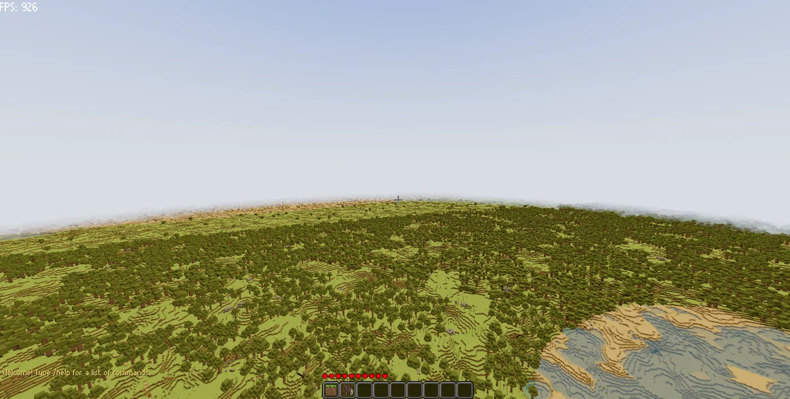

# Farlands



A Minecraft-style voxel engine built in Godot 4 with a custom C++ GDExtension. Procedural terrain generation (signed 3D density field with overhangs and shelves), chunked world streaming, greedy meshing with per-chunk incremental rebuilds, colored block lighting, day/night cycle, three-tier distance-based mesh LOD with LOD-reduced chunks merged into regions to cap draw calls, frustum-prioritized chunk loading, async background chunk saving, and a C++ inventory system (hotbar + 27-slot storage) wired into block break/place with a GDScript GUI, plus data-driven 2×2 crafting (`data/recipes.json`). Ships with a C++ player controller with Minecraft-accurate fixed-timestep physics.

## Architecture

- **Godot 4** — renderer, input, audio, and UI
- **C++ GDExtension** — voxel engine core (chunking, meshing, lighting, terrain gen, collision, player sim)
- **ThreadPool** — async chunk generation, mesh building, and light propagation, sized to `hardware_concurrency() - 1` workers with a high-priority queue
- **RenderingServer** — direct GPU mesh upload for zero SceneTree overhead per chunk
- **Sharded chunk map** — 64 independently-locked shards (`shared_mutex` each), so a write on one shard never blocks readers on another. Recursive shared re-acquisition is forbidden (Windows SRW locks block new shared locks once a writer queues), so lock scopes use `_fast` accessors / `queue_dirty_chunk_fast()` and release before re-locking
- **Palette-compressed storage** — block and light data stored as 8 paletted 16³ sections per chunk instead of dense arrays, cutting per-chunk memory from ~130KB to as little as ~1–20KB on uniform terrain
- **Frustum prioritization** — camera frustum extracted each frame; visible chunks get priority for generation, meshing, retention, and LOD detail
- **Budget-capped main thread** — generation completion, mesh uploads, and light propagation are wall-clock-budgeted per frame; the nearest-to-player completed mesh uploads first

## Key Systems

| System | File(s) | Notes |
|--------|---------|-------|
| Chunk data | `src/core/chunk_data.hpp/cpp` | 32×32×32 chunks, palette-compressed blocks + light (8 × 16³ sections each) |
| Block types | `src/core/block_types.hpp/cpp` | Registry singleton loaded from `data/block_definitions.json` — the single source of truth for block properties, per-face textures, and emissive maps |
| Block shapes | `data/block_shapes.json` | Shared shape registry for non-full blocks (slabs, stairs, walls, poles) with selection/collision boxes and auto-detecting placement |
| Chunk map | `src/core/chunk_map.hpp` | 64-shard `shared_mutex` map, ordered multi-shard locking (`lock_keys`/`lock_all`), resumable bucket-cursor iteration |
| Frustum utility | `src/core/frustum.hpp` | AABB-in-frustum test, used by generation, mesh, unload, and LOD priority |
| World updater | `src/world/world_updater.hpp/cpp` | Per-frame budgeted scheduling (generate → light → mesh → upload); two-phase generation (`update_generation`): a frustum-priority pass first, then a distance-sorted sweep |
| Mesh queue | `src/mesh/mesh_queue.hpp` | Priority queue sorted by urgent > in-frustum > distance |
| Mesh builder | `src/mesh/mesh_builder.hpp/cpp` (+ `mesh_builder_solid.cpp`, `mesh_builder_faces.cpp`, `mesh_builder_greedy.cpp`) | Greedy + standard face culling, neighbor-aware, thread-local instances, solid-block fast path, full rebuilds and incremental partial remeshes |
| Mesh manager | `src/mesh/mesh_manager.hpp` + `mesh_manager.cpp`/`_worker`/`_upload`/`_rebuild`/`_far`/`_lifecycle` (`mesh_manager_internal.hpp` shares the build task) | Upload dedup, lazy RID creation, instance budget capping, three-tier LOD (stride/detail) with LOD-reduced chunks merged into region instances, nearest-first budget-capped completion |
| Lighting | `src/lighting/light_propagator.cpp` | Async block-light propagation on worker threads, sky-light columns, overlap-safe per-channel light removal |
| Terrain gen | `src/worldgen/chunk_generator.hpp/cpp` | Signed 3D density field over a macro heightmap (overhangs/shelves), 4×4×4 shape lattice, biome-based macro surface, chunk-level generation fast paths, continental-scale elevation noise (~1000 block wavelength) with elevation-based weirdness amplification (1-2x multiplier), continentalness warp for wavy coastlines, widened beach biome band for proper shoreline coverage |
| Vegetation | `src/worldgen/vegetation_generator.hpp/cpp` | Tree placement (oak/spruce) with variant-weighted per biome, minimum spacing, deferred cross-chunk writes |
| Vegetation config | `src/worldgen/vegetation_config.hpp` + `data/vegetation.json` | Forest/plains/desert knobs, tree density/variants loaded from JSON |
| Biome config | `src/worldgen/biome_config.hpp` + `data/biomes.json` | Per-biome materials, climate thresholds, tree variants loaded from JSON |
| Terrain config | `src/core/terrain_params.cpp` + `data/terrain_config.json` | Macro height centers, climate scales loaded from JSON |
| Collision | `src/engine/collision_resolver.cpp` | Custom binary-search AABB voxel grid query (no Godot physics nodes), step-up support |
| Day/night | `src/world/day_night_cycle.hpp` | Shader-driven sky-light intensity + color blending |
| Player sim | `src/engine/player_controller.hpp/cpp` | Minecraft-accurate fixed 20-tick/s physics: vanilla jump/sprint/sneak ordering, accumulator, smooth eye-height transitions, fall-distance tracking with vanilla landing damage (1 half-heart per block past 3) |
| LOD | `lod_distance` / `lod_detail_level` / `far_lod_distance` / `far_lod_detail_level` (`mesh_manager.cpp`) | Three tiers — full detail, mid stride/detail reduction, and far tier with its own detail level; LOD-reduced chunks merged into regions; capped remesh-per-frame |
| Frame budgets | `src/core/frame_budgets.hpp` | Tiered budgets for generate/light/mesh/upload (idle/active/loading) |
| Performance timers | `src/core/performance_timer.hpp` | Scoped frame-by-frame profiling |
| Inventory | `src/core/inventory.hpp/cpp` | 9-slot hotbar + 27-slot main storage, 64 stack limit, add/consume/can_add logic, persisted to `user://chunks/inventory.bin` |
| Crafting | `src/core/crafting.hpp/cpp` + `data/recipes.json` | RecipeBook with shapeless (multiset) and shaped (trim + mirror) matching over the 2×2 grid; atomic all-or-nothing crafting; recipes loaded from JSON at startup |
| Crafting table UI | `crafting_table_menu.gd` | 3×3 crafting table menu: a single atlas (`textures/gui/crafting_table.png`) carries both the 36-slot inventory and the 3×3 grid; opens when the player right-clicks a `crafting_table` block (on the `crafting_table_used` signal), closes on Escape/E, with availability-gated recipe preview and atomic craft wired to the C++ RecipeBook |
| Inventory UI | `inventory.gd` / `hotbar.gd` | GDScript `Control` overlays: E toggles the full inventory, mouse wheel cycles the hotbar, click-to-hold / drag-drop stack movement, pixel-color-keyed hover/selection highlights, live 2×2 crafting grid + output preview wired to the C++ RecipeBook |
| Healthbar | `healthbar.gd` | 10 hearts (`heart_full/half/empty.png`) above the hotbar's left edge, spanning ~40% of its width; full/half/empty sprites resolved from the half-heart health polled off `PlayerController.get_health()` |
| Death screen | `death_screen.gd` | "You died!" overlay with a Respawn button; shown on the `died` signal (health reaching 0), hidden on `respawned` — respawn restores full health at the game-start spawn point |
| Chat system | `chat.gd` | GDScript chat with autocomplete: ghost text suggestions with pulsing effect, tab cycling through completions, up/down arrow navigation, hold-to-cycle, parameter hints for commands (`/give <block> [count]`, `/tp <x> <y> <z>`), commands: `/help`, `/give` (unlimited count), `/tp`, `/fly`, `/clearchat`, `/clearinv`, `/version` |
| Inventory drag ops | `inventory.gd` | RMB drag-place (spread 1 unit per slot), LMB drag-collect (sweep matching blocks), shift-click/drag quick-transfer (move between hotbar/main), scroll wheel quick-transfer (push/pull 1 unit), double-click gather (sweep all matching blocks); the same interactions work on the crafting grid cells, and shift-clicking the output crafts as many as possible |
| Settings menu | `settings_menu.gd` | Adjustable settings with persistence (render — including an MSAA 3D Off/2x/4x/8x toggle that sets the root viewport's `msaa_3d` live — plus lighting, crosshair, controls) opened with Escape key; includes a **Skin Maker** page (color wheel + orbitable preview) with paint tools (DRAW/FILL/BOX), grayscale noise slider, skin gallery with load/delete, and a dark-mode toggle; includes a **Block Maker** page (16×16 cube painter) with the same paint tools, grayscale noise slider, block gallery with load/delete, and an orbitable preview; includes **Controls rebinding** page with per-action key/button rebinds, conflict detection, and Reset All button; includes **shareable setting codes** for crosshair and block outline (CS-style base32 import/export) |
| Texture packs | `src/render/texture_pack_manager.hpp` + `tools/pack_converter.py` | Custom texture pack system with per-block texture overrides loaded from `user://packs/` |
| Block outline | Adjustable block outline system with pulse effects, thickness control (0.0-0.99), and fill box with separate color/opacity |
| Crosshair | Adjustable crosshair with rotation, spacing, dot, and color-inversion modes |
| Shareable codes | CS-style base32 export/import codes for crosshair and block outline settings; compact hyphenated format with versioning and clipboard integration |
| Chunk persistence | `src/world/chunk_world.cpp` + `chunk_world_edits.cpp` / `chunk_world_persistence.cpp` | Async background saves: dirty chunks are snapshotted under their shard lock, then RLE-encoded + atomically written on the thread pool; per-key generation gating guarantees the newest data reaches disk; blocking flush on quit |

## Rendering Notes

- Opaque and water are separate mesh surfaces; water uses its own shader (`shaders/voxel_shader_water.gdshader`) with edge fade, tint, shimmer, sun glint, flowing texture animation, and separate blend-mix surface for translucency.
- Blocks can carry an emissive texture (second `Texture2DArray`) for glow, driven by `data/block_definitions.json`.
- The terrain shader (`shaders/voxel_shader.gdshader`) applies a non-linear AO power curve (`pow(raw_ao, 1.35)`) that hides diagonal triangulation seams (soft curved AO). The procedural sky shader (`src/render/sky_controller.hpp`) provides a procedurally twinkling night starfield with a fixed north star, and sky turbidity provides Rayleigh/Mie haze effects.
- Non-full block shapes (slabs, stairs, walls, poles) have proper ambient occlusion and UV texture mapping for their irregular geometry.
- The directional sun light has shadows disabled — both terrain shaders are unshaded, so the shadow pass was pure overhead with no visual effect.
- Block edits trigger an incremental partial remesh (tight dirty-AABB re-emit) instead of a full 32³ rebuild.
- Fog system with 4 modes: Disabled, Edge, Linear, Exponential; fog color matches sky color throughout day/night cycle.
- God rays toggle for atmospheric lighting effects with dynamic sample count.
- MSAA 3D is adjustable in-game (Off/2x/4x/8x cycle button under Settings → Render); it sets the root viewport's `msaa_3d` live and persists across sessions.
- GPU compression option for texture arrays to reduce VRAM usage (S3TC/BC1-BC3).
- Vertex compression (24 bytes per vertex, -40% VRAM) with fixed-point positions.

## Worldgen Config Data

The terrain generation system is data-driven through JSON configuration files:

- **`data/biomes.json`** — Biome definitions with per-biome materials, climate thresholds, tree density, and tree variant weights
- **`data/vegetation.json`** — Vegetation parameters for forest/plains/desert biomes (tree density, min/max counts, spacing, cactus settings)
- **`data/terrain_config.json`** — Macro height centers, climate scales, and terrain amplitude parameters
- **`data/block_shapes.json`** — Shared shape registry for non-full blocks (slabs, stairs, walls, poles) with selection/collision boxes
- **`data/recipes.json`** — Crafting recipes (shaped/shapeless) resolved by block name against `block_definitions.json`; grid size and per-recipe results

These configs are loaded at startup via `VoxelEngineController::load_world_configs()` and threaded to generation workers. Missing files or keys fall back to built-in defaults.

## Assets

Textures are organized in the `textures/` directory:
- `textures/blocks/` — Block textures (bedrock, dirt, grass, stone, sand, water, etc.)
- `textures/gui/` — UI textures (hotbar, inventory background, effects)
- `textures/sprites/` — Sprite textures (hearts, etc.)
- `textures/atmosphere/` — Atmospheric textures (sun, north star)
- `textures/Archive/` — Archived/deprecated textures (old versions kept for reference)

The player model lives in `player.glb` (voxel-style, slim 3-px arms with a tightly-packed 64×64 skin-texture atlas). `player_model.gd` applies a skin texture to the model with nearest filtering (no mipmaps, to avoid blending UV islands), and `skin_preview.gd` is a transparent-background sub-viewport that orbits the model for the skin maker.

### Texture Packs

Texture packs are directories under `user://packs/` (on Windows:
`%APPDATA%\Godot\app_userdata\Farlands\packs\`), each containing:

- `pack.json` — metadata:
  ```json
  {
    "name": "demo",
    "schema": 1,
    "min_supported": 1,
    "max_supported": 1,
    "base_resolution": 16,
    "author": "optional author"
  }
  ```
- `textures/<name>.png` — PNG overrides for individual blocks; names must match
  the built-in files in `textures/blocks/` (e.g. `grass_top.png`). Missing
  textures fall back to the built-ins. Corrupt/truncated PNGs degrade to the
  built-in texture for that name rather than dropping the array layer.

Commands (in-game chat):
- `/texturepack` — list installed packs
- `/texturepack <name>` — activate a pack (case-insensitive)
- `/texturepack off` — back to built-in textures

A full demo pack fixture (7 tinted textures) can be generated from the built-in
textures with `python tools/make_demo_pack.py examples/texture_pack`.

## Build

Requires:
- Godot 4.1+ (GDExtension `compatibility_minimum`); developed against 4.7
- Python 3 + SCons
- C++17 compiler (MSVC on Windows, GCC/Clang on Linux/macOS)
- `godot-cpp` submodule (run `git submodule update --init --recursive` after cloning)

```bash
# Build the extension library
scons

# Build standalone tools
scons debug    # terrain_debug executable
scons bench    # benchmark executable (supports --check <baseline>)
scons test     # builds the doctest suite (see tests/)
scons fuzz     # libFuzzer harnesses (Linux/macOS, clang required)
```

Optional build flags: `TSAN=1` (ThreadSanitizer), `ASAN=1` (ASan+UBSan), `COVERAGE=1` (lcov) — all Linux/macOS only.

CI (`.github/workflows/build.yml`) runs on every push and pull request:
- **Build job** — 5-leg matrix: ubuntu plain, ubuntu TSan, ubuntu ASan+UBSan, macos plain, windows plain. Tests run on every leg; the benchmark regression check (`--check benchmark_baseline.txt`) runs on the non-sanitizer legs.
- **Fuzz job** — builds and runs 5 libFuzzer harnesses (`fuzz_palette`, `fuzz_chunk_load`, `fuzz_chunk_recovery`, `fuzz_light_propagation`, `fuzz_mesh_builder`) for 60 seconds each on Linux.
- **Static-analysis job** — clang-tidy across all of `src/` with `bugprone-*`, `concurrency-*`, and `performance-*` checks; findings in project sources fail the job.
- **Coverage job** — lcov coverage report uploaded to Codecov.

The project has **225 test cases / 163,385 assertions** across 24 doctest files, including 27 tests in `test_concurrency.cpp` (shard locking, deadlock prevention, PaletteStorage, cross-chunk writers, thread-pool work stealing).

## Running

Open the project root in Godot 4 and press Play. The main scene is `Main.tscn`. The C++ extension loads automatically from the platform-specific library declared in `voxel_engine.gdextension` (e.g. `bin/libgdextension.windows.template_debug.x86_64.dll` on Windows).

## Controls

| Key | Action |
|-----|--------|
| W/A/S/D | Move |
| Mouse | Look (click the window to capture the mouse) |
| Space | Jump / ascend in flight |
| Left click | Break block (collects into inventory) |
| Right click | Place block (consumes from the selected hotbar slot) |
| Shift | Sprint |
| Ctrl | Sneak / descend in flight |
| F | Toggle fly mode |
| F5 | Toggle third-person camera |
| 1–9 | Select hotbar slot |
| E | Toggle inventory |
| Mouse wheel | Cycle hotbar selection (while the inventory is closed) |
| Esc | Release the mouse / close the inventory / close chat / open settings menu |
| T | Open chat (to type a message) |
| / | Open chat (to type a command) |
| Tab | Accept autocomplete / cycle through completions (hold to auto-cycle) |
| Up/Down arrows | Cycle through completions (when chat is open and completions are available) |

Input bindings live in `project.godot` (`move_forward`, `move_back`, `move_left`, `move_right`, `jump`, `sprint`, `sneak`, `fly_toggle`, `toggle_inventory`, `toggle_chat`, `toggle_third_person`, `mouse_click_left`, `mouse_click_right`). The C++ `PlayerController` node owns all movement, look, block interaction, and inventory state — there is no player GDScript. The hotbar/inventory screens are GDScript `Control` overlays that read/write that state.

### Controls Rebinding

Settings → Controls page allows rebinding any action to a different key or button:
- Click a binding row, then press the desired key/button to rebind
- Escape cancels the rebind operation
- Per-row Reset button restores the original `project.godot` binding
- Reset All button restores every action to its default binding
- Conflict detection prevents mapping two actions to the same key/button
- Bindings are applied live to InputMap and persisted to `settings.cfg`

## Performance Tuning

The `ChunkManager` node exposes these editor properties (see `src/godot_bindings/chunk_manager.cpp`):

- **seed**, **render_distance**, **player_path**, **player_position**, **auto_update**
- **editor_enabled**, **editor_render_distance**
- **sea_level**, **biome_size** — terrain shape
- **smooth_lighting** — toggle smooth vertex lighting
- **lod_distance**, **lod_detail_level**, **far_lod_distance**, **far_lod_detail_level** — mesh LOD (three-tier stride/detail reduction; LOD-reduced chunks merge into region instances; see `mesh_manager.cpp`)
- **player_light_enabled** / **player_light_level** — player-following dynamic light
- **day_time**, **day_night_cycle_enabled**, **day_duration**, **day_sky_intensity**/**night_sky_intensity**, **day_sky_color**/**night_sky_color**
- **fog_density** — exponential fog distance
- **mipmaps_enabled** — toggle mipmap generation on the block/emissive texture arrays (regenerates the arrays live; disables the shader LOD bias so only the base level is sampled)
- **mipmap_bias** — shader LOD bias for block-texture sampling (both terrain and water; ignored when `mipmaps_enabled` is off)
- **textures_enabled** — toggle real block textures vs. a magenta/black checker placeholder (regenerates the arrays live; emissive layers become black when off)
- **vegetation_enabled** — toggle tree/vegetation generation
- **move_speed_multiplier** — global player movement speed multiplier
- **debug_enabled**, **debug_print_interval** — performance report logging
- **FrameBudgets** (in `src/core/frame_budgets.hpp`) — per-frame generation/mesh/upload caps

The `PlayerController` node exposes **sensitivity** (mouse look), **fly_speed**, and **health** (half-hearts 0–20; fall damage drains it).

## Settings Menu Features

The Settings menu (Escape key) includes several customization pages:

### Render Settings
- MSAA 3D toggle (Off/2x/4x/8x) — sets root viewport's `msaa_3d` live
- GPU texture compression toggle
- Mipmap generation toggle
- Vertex compression toggle
- Fog mode selection (Disabled/Edge/Linear/Exponential)
- God rays toggle
- Sky turbidity adjustment

### Lighting Settings
- AO color and strength
- Darkness color
- Contrast and saturation

### Crosshair Settings
- Rotation, spacing, dot toggle
- Color inversion mode
- Export/Import shareable codes (CS-style base32 format)

### Block Outline Settings
- Thickness control (0.0-0.99)
- Pulse effects
- Fill box with separate color/opacity
- Export/Import shareable codes (CS-style base32 format)

### Skin Maker
- Color wheel with live hex readout
- Paint tools: DRAW (single pixel), FILL (flood fill), BOX (inclusive box draw)
- Grayscale noise slider (persists per skin)
- Dark/Light mode toggle
- Skin gallery with 3D spinning previews
- Load and delete saved skins
- Transparent sub-viewport with drag-orbit camera

### Block Maker
- Single 16×16 cube texture applied to every face
- Paint tools: DRAW (single pixel), FILL (flood fill), BOX (inclusive box draw)
- Grayscale noise slider (persists per block, reversible)
- Undo (Ctrl+Z) recording per-texel changes
- Block gallery with 3D spinning previews
- Load and delete saved blocks (`user://blocks/`)
- Transparent sub-viewport with drag-orbit camera and clamped zoom

### Block Breaking
- Hold LMB to break: hardness (seconds) comes from each block's `hardness` in `data/block_definitions.json` (`-1.0` = unbreakable, e.g. bedrock/water)
- 10-stage crack overlay (`textures/animated/l0_sprite_01-10.png`) shown on the mined block like Minecraft
- Progress pauses when you release LMB and resumes on the same block; aiming elsewhere restarts it
- Inventory full still gate-checks before progress accumulates

### Controls
- Per-action key/button rebinding
- Conflict detection
- Per-row Reset buttons
- Reset All button

## Notes

- The player is a C++ `PlayerController` node (`src/engine/player_controller.*` + `src/godot_bindings/player_controller.*`) — fixed 20-tick/s simulation with an accumulator, vanilla-accurate jump/sprint/sneak ordering, smooth eye-height transitions, fly mode, raycast-based block break/place, and vanilla fall damage (1 half-heart per block past a 3-block safe fall, applied on landing). There is no player GDScript. The GUI layer (hotbar, full inventory screen, health bar, death screen, block-texture atlas) is GDScript (`hotbar.gd`, `inventory.gd`, `healthbar.gd`, `death_screen.gd`, `block_textures.gd`).
- Modified chunks are saved to `user://chunks/` as versioned RLE-compressed `.chunk` files (v3 format with a CRC32 checksum; v2/v1 legacy files load transparently). Saves are asynchronous — `WorldUpdater` snapshots dirty chunks every 5s and writes them on the thread pool, and `ChunkManager::_exit_tree()` performs a blocking flush so nothing is lost on quit. The inventory persists to `user://chunks/inventory.bin` (magic `INVE`, version 1) and is written at `_exit_tree`.
- `analyze.py` analyzes biome maps produced by the `terrain_debug` tool; it requires `Pillow`, `numpy`, and `scipy`, which aren't otherwise part of the build.
- See [AGENTS.md](AGENTS.md) for detailed development guidelines and architecture notes.
- See [roadmap.md](roadmap.md) for the project roadmap.
