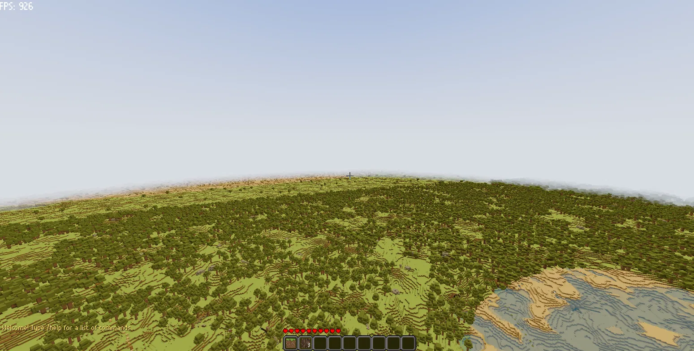
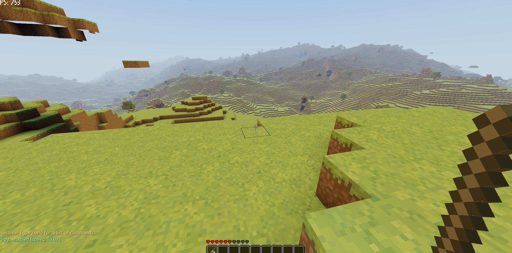

# Farlands

**Old terrain**



**New terrain**



A Minecraft-style voxel engine built in Godot 4 with a custom C++ GDExtension. Procedural
terrain generation (a stacked-noise macro surface with domain warp and ~500/150-block relief
fields, wrapped by a signed 3D density field that adds overhangs and shelves in strength-gated
"weirdness" zones, plus oceans that flood the below-sea remnants of biome-shaped terrain),
chunked world streaming, greedy meshing with per-chunk incremental rebuilds, colored block
lighting, day/night cycle, three-tier distance-based mesh LOD with LOD-reduced chunks merged
into regions to cap draw calls, frustum-prioritized chunk loading, async background chunk
saving, and a C++ inventory system (hotbar + 27-slot storage) wired into block break/place with
a GDScript GUI, plus data-driven 2×2 crafting (`data/recipes.json`). Ships with a C++ player
controller with Minecraft-accurate fixed-timestep physics and a punchable combat dummy (K key)
with vanilla 1.8.8 knockback.

## Architecture

- **Godot 4** — renderer, input, audio, and UI
- **C++ GDExtension** — voxel engine core (chunking, meshing, lighting, terrain gen, collision,
  player sim)
- **ThreadPool** — async chunk generation, mesh building, and light propagation, sized to
  `hardware_concurrency() - 1` workers with a high-priority queue
- **RenderingServer** — direct GPU mesh upload for zero SceneTree overhead per chunk
- **Sharded chunk map** — 64 independently-locked shards (`shared_mutex` each), so a write on
  one shard never blocks readers on another. Recursive shared re-acquisition is forbidden
  (Windows SRW locks block new shared locks once a writer queues), so lock scopes use `_fast`
  accessors / `queue_dirty_chunk_fast()` and release before re-locking
- **Palette-compressed storage** — block and light data stored as 8 paletted 16³ sections per
  chunk instead of dense arrays, cutting per-chunk memory from ~130KB to as little as ~1–20KB on
  uniform terrain
- **Frustum prioritization** — camera frustum extracted each frame; visible chunks get priority
  for generation, meshing, retention, and LOD detail
- **Budget-capped main thread** — generation completion, mesh uploads, and light propagation are
  wall-clock-budgeted per frame; the nearest-to-player completed mesh uploads first

## Key Systems

One row per system: the short answer here, the reasoning in `docs/`. The file column names
individual files only where the set is small; a `src/<dir>/` entry means the whole directory,
and a wildcard like `src/mesh/mesh_manager*.cpp` means the family a split produced.

| System | File(s) | Notes |
|--------|---------|-------|
| Chunk data | `src/core/chunk_data.hpp/cpp` | 32x32x32 chunks; palette-compressed blocks and light, 8 x 16^3 sections each |
| Block types | `src/core/block_types.hpp/cpp` | Registry singleton loaded from `data/block_definitions.json` - the single source of truth for block properties, per-face textures and emissive maps |
| Block shapes | `data/block_shapes.json` | Slabs, stairs, walls, poles, fences and the crucible; a shape is a list of AABBs and collision defaults to what is visible - [shapes](docs/shapes.md) |
| Chunk map | `src/core/chunk_map.hpp` | 64-shard `shared_mutex` map, ordered multi-shard locking (`lock_keys`/`lock_all`), resumable bucket-cursor iteration |
| Frustum utility | `src/core/frustum.hpp` | AABB-in-frustum test, used by generation, meshing, unload and LOD priority |
| World updater | `src/world/world_updater.hpp/cpp` | Per-frame budgeted scheduling: generate -> light -> mesh -> upload - [streaming](docs/streaming.md) |
| Mesh queue | `src/mesh/mesh_queue.hpp` | Priority queue sorted urgent > in-frustum > distance |
| Mesh builder | `src/mesh/mesh_builder*.cpp`, `mesh_fluid.hpp` | Greedy + neighbour-aware culling, thread-local instances, incremental partial remeshes, per-corner liquid surface - [rendering](docs/rendering-notes.md) |
| Mesh manager | `src/mesh/mesh_manager*.cpp` | Upload dedup over BOTH surfaces, LOD-reduced chunks merged into 8x8-chunk regions, the liquid-geometry invariant - [rendering](docs/rendering-notes.md) |
| Lighting | `src/lighting/light_propagator.cpp` | Async block-light propagation, sky-light columns, overlap-safe per-channel removal |
| Terrain generation | `src/worldgen/chunk_generator*.cpp` | Stacked-noise macro surface, signed 3D density overhangs, oceans, shape/climate lattices - [notes](docs/terrain-notes.md), [description](ARCHITECTURE.md#terrain-generation) |
| Vegetation | `src/worldgen/vegetation_generator.hpp/cpp` | Tree placement per biome, variant-weighted, minimum spacing, deferred cross-chunk writes |
| Biome & terrain config | `biome_config.hpp`, `terrain_params.cpp` | `data/biomes.json` and `data/terrain_config.json` - [schemas](docs/data-schemas.md) |
| Collision | `src/engine/collision_resolver.cpp` | Binary-search AABB voxel query with no Godot physics nodes; step-up support |
| Pathfinding | `src/pathfinding/` | Godot-free ground-route planner: budgeted A*, string-pull smoothing, each search on the pool - [notes](docs/pathfinding.md) |
| Block file import | `src/schematic/` | Reads both families of build file with no Godot and no zlib; `/paste` places one - [notes](docs/schematic-notes.md) |
| Fluid flow | `src/fluids/` | Poured water flows and generated water does not; lava and acid are the same rules with their own numbers - [notes](docs/fluids.md) |
| Day/night | `src/world/day_night_cycle.hpp` | Shader-driven sky-light intensity and colour blending |
| Player physics | `src/engine/player_controller.hpp/cpp` | Fixed 20-tick/s vanilla ordering (jump/sprint/sneak), accumulator, fall distance and landing damage |
| Player camera & body | `player_controller.cpp`, `player_model.gd`, `pose_clone_debug.gd` | F5 cycles first person / behind / in front; aiming always casts from the eye; vanilla body-yaw lag; K spawns the dummy |
| LOD | `mesh_manager.cpp` (`lod_*`, `far_lod_*`) | Three tiers by distance; reduced chunks merged into regions; capped remesh per frame |
| Frame budgets & timers | `src/core/frame_budgets.hpp`, `performance_timer.hpp` | Tiered idle/active/loading budgets; scoped frame-by-frame profiling |
| Inventory | `src/core/inventory.hpp/cpp` | 9-slot hotbar + 27-slot storage, 64 per stack, persisted to `user://chunks/inventory.bin` |
| Crafting | `src/core/crafting.hpp/cpp` + `data/recipes.json` | Shaped (trim + mirror) and shapeless matching over any NxN grid, atomic craft |
| Items & tool stats | `src/core/item_registry.hpp/cpp`, `mining.hpp` + `data/items.json` | Tool class/tier speed, hammer crushing, block `drops`, held light, bucket use - [notes](docs/gui-notes.md) |
| Inventory UI | `inventory.gd`, `hotbar.gd`, `crafting_table_menu.gd` | E toggles the full screen, drag/drop and shift-click transfer, 3x3 table from `crafting_table_used`, live 2x2 grid |
| Block icons | `block_icon_renderer.gd` | Isometric 300x300 icons built from each shape's selection boxes, pre-rendered and cached; `/testicons` |
| Health, death, chat | `healthbar.gd`, `death_screen.gd`, `chat.gd` | 10 hearts, the respawn overlay, autocomplete and the command set |
| Settings, Skin Maker, Block Maker | `settings_menu.gd` | Render/lighting/crosshair/controls pages, both in-game editors, one share code per category - [notes](docs/gui-notes.md) |
| Testing & CI | `tests/`, `tools/`, `.github/workflows/build.yml` | 594 cases / 347,656 assertions, four static gates, the soak and fuzz jobs - [notes](docs/testing.md), [contributing](CONTRIBUTING.md) |
| Shader effects | `shader_overlay.gd` + `data/shaders.json` | The effect stack (Hand Drawn, CRT Screen, Phosphor Trail, filters, camera and vertex effects), built from the registry - [rendering](docs/rendering-notes.md) |
| Liquid texture lab | `liquid_texture_lab.gd`, `liquid_animator.gd` | Generates and animates the water/lava/acid sprites instead of shipping them (O opens the lab) - [rendering](docs/rendering-notes.md) |
| Texture packs | `src/render/texture_pack_manager.hpp`, `tools/pack_converter.py` | Per-block texture overrides loaded from `user://packs/` |
| Block outline & crosshair | in `settings_menu.gd` | Pulse/thickness/fill outline, rotatable crosshair, CS-style base32 share codes |
| Chunk persistence | `src/world/chunk_world*.cpp` | Dirty chunks snapshotted under their shard lock, RLE + atomic write on the pool, generation-gated, blocking flush on quit |

## Rendering Notes

- Opaque and water are separate mesh surfaces; water uses its own shader
  (`shaders/voxel_shader_water.gdshader`) with edge fade, tint, shimmer, sun glint, flowing
  texture animation, and separate blend-mix surface for translucency.
- Blocks can carry an emissive texture (second `Texture2DArray`) for glow, driven by
  `data/block_definitions.json`.
- The terrain shader (`shaders/voxel_shader.gdshader`) applies a non-linear AO power curve
  (`pow(raw_ao, 1.35)`) that hides diagonal triangulation seams (soft curved AO). The procedural
  sky shader (`src/render/sky_controller.hpp`) provides a procedurally twinkling night starfield
  with a fixed north star, and sky turbidity provides Rayleigh/Mie haze effects.
- Non-full block shapes (slabs, stairs, walls, poles) have proper ambient occlusion and UV
  texture mapping for their irregular geometry.
- The directional sun light has shadows disabled — both terrain shaders are unshaded, so the
  shadow pass was pure overhead with no visual effect.
- Block edits trigger an incremental partial remesh (tight dirty-AABB re-emit) instead of a full
  32³ rebuild.
- Fog system with 4 modes: Disabled, Edge, Linear, Exponential; fog color matches sky color
  throughout day/night cycle.
- God rays toggle for atmospheric lighting effects with dynamic sample count.
- MSAA 3D is adjustable in-game (Off/2x/4x/8x cycle button under Settings → Render); it sets the
  root viewport's `msaa_3d` live and persists across sessions.
- GPU compression option for texture arrays to reduce VRAM usage (S3TC/BC1-BC3).
- Vertex compression (24 bytes per vertex, -40% VRAM) with fixed-point positions.

## Terrain Generation

Terrain is built in three stages — a macro surface from stacked noise layers, a biome-shaping
pass whose below-sea remnants become ocean, then a strength-gated 3D density field wrapped
around that surface (full diagram in [ARCHITECTURE.md](ARCHITECTURE.md#terrain-generation)):

```
 noise layers @ warped point → macro height per column
   base 12k ±500 · detail 1k ±100 · ridged flow ×16
   + 500-block relief (±90) + 150-block relief (±25)
        │ climate grid → land biome (Plains/Hills); its height knob shapes
        │ the column; still below sea_level (200)? → Ocean last, water to sea
        ▼
 weirdness fBm (~42-block lobes) → strength 5..50
        ▼
 density = (height − y) + shape · strength · band(9→28)
   shape = 3-octave fBm on a 4³ world lattice (~38-block features)
        ▼
 per-chunk: fast paths → density/material pass → cleanup → vegetation
```

- **Biomes first, oceans last** — every column first gets a land biome from the climate grid
  (Plains/Hills) and that biome's height knob alters its terrain; columns that still end below
  sea level become Ocean last (water filled to sea level, sand surfaces, sea bed keeps the land
  biome's shape). Coasts are seamless by construction. Continentalness (the 12000-block base
  layer, normalized [0,1]) is sampled and carried per column for future preferred-profile biome
  selection — it never gates water.
- **Strength-gated 3D shaping** — a low-frequency 2D "weirdness" mask picks where the signed 3D
  shape field is strong enough to produce overhangs/shelves; everywhere else the terrain is
  plain macro surface.
- **All tuning is data-driven** (`data/terrain_config.json` → `TerrainParams`);
  temperature/humidity climate samplers are live (~8000-block climate features, read through a
  recursive anisotropic domain warp so biome boundaries flow, sampled on a 4-block lattice) —
  the temperate band of land is Plains, the cold/hot bands are Hills, and water is Ocean.
  Per-biome height/weirdness amplification knobs (including `weirdness_size_amplification`,
  which scales both the reach and the displacement of a weirdness zone) are blended across
  borders (uniform window average over the climate lattice — radius 0 means each column keeps
  its own biome's knobs exactly — `climate_blend_radius_nodes` in the terrain config), so relief
  ramps smoothly at biome boundaries instead of stepping.

## Worldgen Config Data

The terrain generation system is data-driven through JSON configuration files:

- **`data/biomes.json`** — Per-biome surface materials (Ocean/Hills/Plains),
  height/weirdness/size amplification knobs,
  `preferred_continentalness`/`preferred_temperature`/`preferred_humidity` (reference data for
  future biome selection), and tree density/variant weights; climate thresholds feed the 3×3
  temperature×humidity land-biome grid (temperate band → Plains, cold/hot → Hills)
- **`data/vegetation.json`** — Vegetation parameters for the hills biome (sparse single-tree
  chance, spacing)
- **`data/terrain_config.json`** — Macro-surface tuning: `height_base_y`, domain-warp
  amplitudes, mid/small relief field spacing/frequency/amplitude, shape-strength range,
  weirdness thresholds, climate warp amps, amplification blend radius
- **`data/block_shapes.json`** — Shared shape registry for non-full blocks (slabs, stairs,
  walls, poles) with selection/collision boxes
- **`data/block_definitions.json`** — the block registry (entry order = save-format ID, so
  append only), including `hardness`, the `preferred_tool`/`min_tier` pair, an optional `drops`
  naming what the block yields when broken by anything (stone → cobblestone), and an optional
  `crush_result` naming the block a **hammer** leaves behind instead of that (cobblestone →
  gravel; a crush wins over a drop). Both are resolved by name, so the target may be declared
  later in the file than the block referring to it — see the hammer row above. JSON has no
  comments, so notes about an entry go in a `"_comment"` key — the loaders read named fields
  only and ignore unknown keys
- **`data/recipes.json`** — Crafting recipes (shaped/shapeless) resolved by block name against
  `block_definitions.json`; grid size and per-recipe results. A shaped `key` entry may list
  several acceptable ingredients (e.g. every plank type), expanded at load into one concrete
  recipe per combination; all the cells of one symbol use the same ingredient, so a wooden tool
  is always a single wood type. Names resolve against items as well as blocks, which is what
  makes the iron tools and the empty bucket (three `iron_ingot` in a V) craftable
- **`data/items.json`** — Non-placeable items (entry order = id, starting at 1024; append rather
  than insert so existing ids keep their meaning) with an optional `"tool"` object
  (`class`/`tier`/`speed`) granting a break-speed bonus against blocks whose `preferred_tool`
  matches (the `hammer` class also matches any block with a `crush_result`, and crushes it), and
  an optional `"pose"` naming the held-item resting position to render with ("item" by default,
  "item2" for sprites rotated a quarter turn, e.g. the water bucket), and an optional `"use"`
  object (`{ "kind": "pour", "block": "water" }`) giving the item an in-world right-click
  action: `pour` writes that block into the cell the crosshair is against, which is how a bucket
  empties — `water_bucket`, `lava_bucket` and `acid_bucket` each name their own block, and the
  pour path knows nothing about which substance it is placing (a pour is still not consumed) —
  and `fill` (`{ "kind": "fill" }`, no block) does the opposite: it EMPTIES the fluid source the
  crosshair is on and swaps the item for that fluid's filled bucket by name (`water` →
  `water_bucket`), so an empty `bucket` is a bucket of anything. A source the simulation does
  not own is refused (`surface_water`, the generated ocean: not a fluid state, so the hole would
  be permanent), as is the falling column (full strength, but not a source), and if no item is
  named for that fluid nothing is taken. There is also an optional `"light"` object
  (`{ "level": 14, "color": [1.0, 0.83, 0.6] }`): while an item with one is in the selected slot
  it OWNS the player's dynamic light — level and colour come from here and the light is forced
  on — and putting it away restores the level, colour and `player_light_enabled` the scene had
  before, so holding a torch is what turns dynamic lighting on. Items are still never placeable,
  an item with no `"use"` entry (and no `"light"`) does nothing when right-clicked, and a
  `use.block` name that does not resolve is reported at load instead of silently doing nothing

These configs are loaded at startup via `VoxelEngineController::load_world_configs()` and
threaded to generation workers. Missing files or keys fall back to built-in defaults.

## Assets

Textures are organized in the `textures/` directory:
- `textures/blocks/` — Block textures (bedrock, dirt, grass, stone, sand, water, etc.).
  `water.png` is hand-authored; `lava.png` and `acid.png` are baked from their generator presets
  by `tools/bake_liquid_textures.gd` so the array has a layer to build and the animator has one
  to write into
- `textures/items/` — Item and tool sprites, resolved from the bare name `data/items.json` gives
  each one
- `textures/animated/` — The ten cracked-block overlay frames the break animation steps through
- `textures/gui/` — UI textures (hotbar, inventory background, effects, settings/tool icons)
- `textures/sprites/` — Sprite textures (hearts, etc.)
- `textures/atmosphere/` — Atmospheric textures (sun, north star)
- `textures/mobs/` — Mob skins
- `textures/0Archive/` — Archived/deprecated textures (old versions kept for reference)

The player model lives in `player.glb` (voxel-style, slim 3-px arms with a tightly-packed 64×64
skin-texture atlas). `player_model.gd` applies a skin texture to the model with nearest
filtering (no mipmaps, to avoid blending UV islands), and `skin_preview.gd` is a
transparent-background sub-viewport that orbits the model for the skin maker.

### Texture Packs

Texture packs are directories under `user://packs/` (on Windows:
`%APPDATA%\Godot\app_userdata\Farlands\packs\`), each containing:

- `pack.json` — metadata:
  ```json
  {
    "name": "demo",
    "schema": 1,
    "min_supported": 1,
    "max_supported": 1,
    "base_resolution": 16,
    "author": "optional author"
  }
  ```
- `textures/<name>.png` — PNG overrides for individual blocks; names must match
  the built-in files in `textures/blocks/` (e.g. `grass_top.png`). Missing
  textures fall back to the built-ins. Corrupt/truncated PNGs degrade to the
  built-in texture for that name rather than dropping the array layer.

Commands (in-game chat):
- `/texturepack` — list installed packs
- `/texturepack <name>` — activate a pack (case-insensitive)
- `/texturepack off` — back to built-in textures

A full demo pack fixture (7 tinted textures) can be generated from the built-in
textures with `python tools/make_demo_pack.py examples/texture_pack`.

## Build

Requires:
- Godot 4.1+ (GDExtension `compatibility_minimum`); developed against 4.7
- Python 3 + SCons
- C++17 compiler (MSVC on Windows, GCC/Clang on Linux/macOS)
- `godot-cpp` submodule (run `git submodule update --init --recursive` after cloning)

The submodule is pinned, so a clone reproduces the same bindings. Check it with
`git submodule status`; the commit this tree is pinned to is:

| Field | Value |
|-------|-------|
| Commit | `e83fd0904c13356ed1d4c3d09f8bb9132bdc6b77` |
| Describe | `godot-3.3.3-stable-1237-ge83fd09` |
| Date | 2025-09-15 |
| Upstream | synced with `876b290332ec6f2e6d173d08162a02aa7e6ca46d` (4.5-stable) |

To move it, `git -C godot-cpp checkout <sha>` then commit the gitlink. Bumping
it changes the generated bindings, so rebuild the extension afterwards.

```bash
# Build the extension library
scons

# Build standalone tools
scons debug    # terrain_debug executable
scons bench    # benchmark executable (supports --check <baseline>)
scons test     # builds the doctest suite (see tests/)
scons sizecheck   # fails if any .cpp/.hpp passes 500 lines (also a CI step)
scons portability # fails on a Windows-only shape outside #ifdef _WIN32 (also a CI step)
scons docscheck   # fails if the markdown cites a path that does not exist (also a CI step)
scons path_cost # planner cost over real terrain (bin/path_cost [seed] [max_distance])
scons schematic_report # decode a build file (bin/schematic_report <file> [--top N | --all] [--table PATH] [--plan] [--repeat N])
# in game: K spawns the punchable dummy, P plans a route from it to the player
# (red cubes on the blocks the route walks on), L toggles grid/waypoints
# in game: O opens the Liquid Texture Lab (animated water/lava/acid authoring)
#   Live previews a strip in the world; "Bind to world" makes it the strip the
#   running game animates that liquid with (LiquidAnimator, on by default)
# bake a still block texture for a liquid from its preset:
#   godot --headless --path . --script res://tools/bake_liquid_textures.gd
scons fuzz     # libFuzzer harnesses (Linux/macOS, clang required)
```

Optional build flags: `TSAN=1` (ThreadSanitizer), `ASAN=1` (ASan+UBSan), `COVERAGE=1` (lcov) —
all Linux/macOS only.

CI (`.github/workflows/build.yml`) runs on every push and pull request:
- **Build job** — 5-leg matrix: ubuntu plain, ubuntu TSan, ubuntu ASan+UBSan, macos plain,
  windows plain. Tests run on every leg; the benchmark regression check
  (`--check benchmark_baseline.txt`) runs on the non-sanitizer legs.
- **Fuzz job** — builds and runs 5 libFuzzer harnesses (`fuzz_palette`, `fuzz_chunk_load`,
  `fuzz_chunk_recovery`, `fuzz_light_propagation`, `fuzz_mesh_builder`) for 60 seconds each on
  Linux.
- **Static-analysis job** — clang-tidy across all of `src/` with `bugprone-*`, `concurrency-*`,
  and `performance-*` checks; findings in project sources fail the job. It runs on Linux, so
  Windows-only code (the `#ifdef _WIN32` halves) is outside its reach by construction.
- **Coverage job** — lcov coverage report uploaded to Codecov.The build and fuzz jobs
  additionally run `python tools/check_file_sizes.py` (**no C++ file above 500 lines**, warning
  at 480), and the build job runs `python tools/check_portability.py` (no Windows-only include,
  `#pragma`, intrinsic or Win32 type outside an `#ifdef _WIN32` region, and no standard
  attribute written after a decl-specifier) and `python tools/check_docs.py` (every path the
  documentation cites must exist, the counts it states must match the tree, and no doc line may
  exceed the review budget). All three compile-or-read happily on MSVC and are fatal on
  GCC/clang, which is why the tree is checked by something other than MSVC before it is
  accepted; the same three are available locally as `scons sizecheck`, `scons portability` and
  `scons docscheck`.

## Documentation

The docs are split by the question they answer: [docs/README.md](docs/README.md) is the index.
In short — [ARCHITECTURE.md](ARCHITECTURE.md) for how the engine works and why,
[docs/howto.md](docs/howto.md) for the files a change touches,
[docs/data-schemas.md](docs/data-schemas.md) for every field of the `data/*.json` files, the
per-system pages ([shapes](docs/shapes.md), [streaming](docs/streaming.md),
[UI](docs/ui.md)) with their engineering notes beside them ([shapes](docs/shapes-notes.md),
[rendering](docs/rendering-notes.md), [GUI](docs/gui-notes.md),
[schematics](docs/schematic-notes.md)), [docs/glossary.md](docs/glossary.md) for the
vocabulary, [docs/debugging.md](docs/debugging.md) for the instruments,
[docs/probes.md](docs/probes.md) for the probe suite, and
[docs/decisions/README.md](docs/decisions/README.md) for what has already been tried and
rejected. [AGENTS.md](AGENTS.md) is the engineering record: the constraints and the notes that
cut across systems.

The project has **594 test cases / 347,656 assertions** across the 91 `.cpp` files in `tests/`
(89 declaring cases, plus the doctest entry point and a stub TU), including 27 tests in
`test_concurrency.cpp` (shard locking, deadlock prevention, PaletteStorage, cross-chunk writers,
thread-pool work stealing).

## Running

Open the project root in Godot 4 and press Play. The main scene is `Main.tscn`. The C++
extension loads automatically from the platform-specific library declared in
`voxel_engine.gdextension` (e.g. `bin/libgdextension.windows.template_debug.x86_64.dll` on
Windows).

## Controls

| Key | Action |
|-----|--------|
| W/A/S/D | Move |
| Mouse | Look (click the window to capture the mouse) |
| Space | Jump / ascend in flight |
| Left click | Break block (collects into inventory) + punch animation; punches the K-key dummy when it's under the crosshair (vanilla knockback) |
| Right click | Place block (consumes from the selected hotbar slot) + place animation |
| Shift | Sprint |
| Ctrl | Sneak / descend in flight |
| F | Toggle fly mode |
| F5 | Cycle camera view: first person → behind the player → in front of the player (looking at your face) |
| K | Spawn/remove a rigid physics dummy of the player on the aimed block — no animations, falls with vanilla gravity/drag, punchable with left click (debug: shows a cube at each mesh pivot) |
| 1–9 | Select hotbar slot |
| E | Toggle inventory |
| Mouse wheel | Cycle hotbar selection (while the inventory is closed) |
| Esc | Release the mouse / close the inventory / close chat / open settings menu |
| T | Open chat (to type a message) |
| / | Open chat (to type a command) |
| Tab | Accept autocomplete / cycle through completions (hold to auto-cycle) |
| Up/Down arrows | Cycle through completions (when chat is open and completions are available) |

Input bindings live in `project.godot` (`move_forward`, `move_back`, `move_left`, `move_right`,
`jump`, `sprint`, `sneak`, `fly_toggle`, `toggle_inventory`, `toggle_chat`,
`toggle_third_person`, `mouse_click_left`, `mouse_click_right`, `pose_clone_toggle`,
`toggle_chunk_borders` — the last one shows the 32-block chunk grid around the player as X-ray
lines, `chunk_borders.gd`, off by default). The C++ `PlayerController` node owns all movement,
look, block interaction, and inventory state — there is no player GDScript. The hotbar/inventory
screens are GDScript `Control` overlays that read/write that state.

Liquids are passable and swimmable: a liquid never stops a body (worldgen oceans included — you
fall in, and the third-person cameras look straight through it), and while any part of the body
is inside one it sinks slowly (~1.6 blocks/s), accelerates and moves at a fraction of land
speed, rises while jump is held, gets lifted when it swims into a bank, and takes no fall damage
on entry.

Three substances flow, each with its own bucket: **water** (a source spreads a diamond of radius
7, one cell per quarter second, and two sources over solid ground turn the cell between them
into another source, so a poured pool feeds itself), **lava** (three cells out, one cell per
second, and it does pool), and **acid** (water's reach on a faster clock, hunts a drop one cell
further, and it does **not** pool — a splash spends itself and drains). All three drain again
when their source is removed. Generated water is deliberately inert: the ocean worldgen fills
declares no fluid state, so it never ticks or spills, and a poured bucket pools against it.
Their textures animate as you play — the stripes you see on water, lava and acid are generated
by the same automaton the Liquid Texture Lab (O) authors, played into the texture array by an
autoload animator; press O and hit "Bind to world" to make one of your own tuned strips the one
the game plays. Right-clicking a source with the empty `bucket` takes it: the cell empties (the
fluid around it settles back in) and the bucket becomes that fluid's own bucket, so a spill can
be picked back up — the bucket is what makes a poured pool reversible

The F5 back/front cameras sit on your look ray 4 blocks out and slide in before any solid block,
so they never clip through terrain; the in-front view looks back at your face. Block targeting
casts from your eye along the look direction in every view (like vanilla's eye-ray trace), so
the crosshair, block outline, and the player's head all agree with first person. In third person
the body lags behind your look Minecraft-style: the torso eases toward your movement direction
(dragged along once your head leads it by more than ~35°) while the head tracks your aim
continuously.

### Controls Rebinding

Settings → Controls page allows rebinding any action to a different key or button:
- Click a binding row, then press the desired key/button to rebind
- Escape cancels the rebind operation
- Per-row Reset button restores the original `project.godot` binding
- Reset All button restores every action to its default binding
- Conflict detection prevents mapping two actions to the same key/button
- Bindings are applied live to InputMap and persisted to `settings.cfg`

## Performance Tuning

The `ChunkManager` node exposes these editor properties (see
`src/godot_bindings/chunk_manager.cpp`):

- **seed**, **render_distance**, **player_path**, **player_position**, **auto_update**
- **editor_enabled**, **editor_render_distance**
- **sea_level**, **biome_size** — terrain shape
- **smooth_lighting** — toggle smooth vertex lighting
- **lod_distance**, **lod_detail_level**, **far_lod_distance**, **far_lod_detail_level** — mesh
  LOD (three-tier stride/detail reduction; LOD-reduced chunks merge into region instances; see
  `mesh_manager.cpp`)
- **player_light_enabled** / **player_light_level** — player-following dynamic light
- **day_time**, **day_night_cycle_enabled**, **day_duration**,
  **day_sky_intensity**/**night_sky_intensity**, **day_sky_color**/**night_sky_color**
- **fog_density** — exponential fog distance
- **mipmaps_enabled** — toggle mipmap generation on the block/emissive texture arrays
  (regenerates the arrays live; disables the shader LOD bias so only the base level is sampled)
- **mipmap_bias** — shader LOD bias for block-texture sampling (both terrain and water; ignored
  when `mipmaps_enabled` is off)
- **textures_enabled** — toggle real block textures vs. a magenta/black checker placeholder
  (regenerates the arrays live; emissive layers become black when off)
- **vegetation_enabled** — toggle tree/vegetation generation
- **move_speed_multiplier** — global player movement speed multiplier
- **debug_enabled**, **debug_print_interval** — performance report logging
- **FrameBudgets** (in `src/core/frame_budgets.hpp`) — per-frame generation/mesh/upload caps

The `PlayerController` node exposes **sensitivity** (mouse look), **fly_speed**, and **health**
(half-hearts 0–20; fall damage drains it).

## Settings Menu Features

The Settings menu (Escape key) includes several customization pages:

### Render Settings
- MSAA 3D (Off/2x/4x/8x)
- Fog mode (Disabled/Edge/Linear/Exponential)
- God rays toggle
- Sky turbidity
- AO color/strength
- Darkness color
- Contrast
- Saturation

### Lighting Settings
- Ambient light intensity
- Sun light intensity
- Player light toggle/level

### Crosshair Settings
- Rotation
- Spacing
- Dot visibility
- Color inversion
- Export/import shareable codes

### Block Outline Settings
- Thickness
- Pulse effect
- Fill color/opacity
- Export/import shareable codes

### Controls Settings
- Per-action key/button rebinding
- Conflict detection
- Reset per-binding
- Reset All

### Skin Maker
- Color wheel picker
- Paint tools (DRAW/FILL/BOX)
- Grayscale noise slider
- Skin gallery (load/delete)
- Dark mode toggle
- 3D orbitable preview

### Block Maker
- 16×16 cube painter
- Paint tools (DRAW/FILL/BOX)
- Grayscale noise slider
- Block gallery (load/delete)
- 3D orbitable preview
